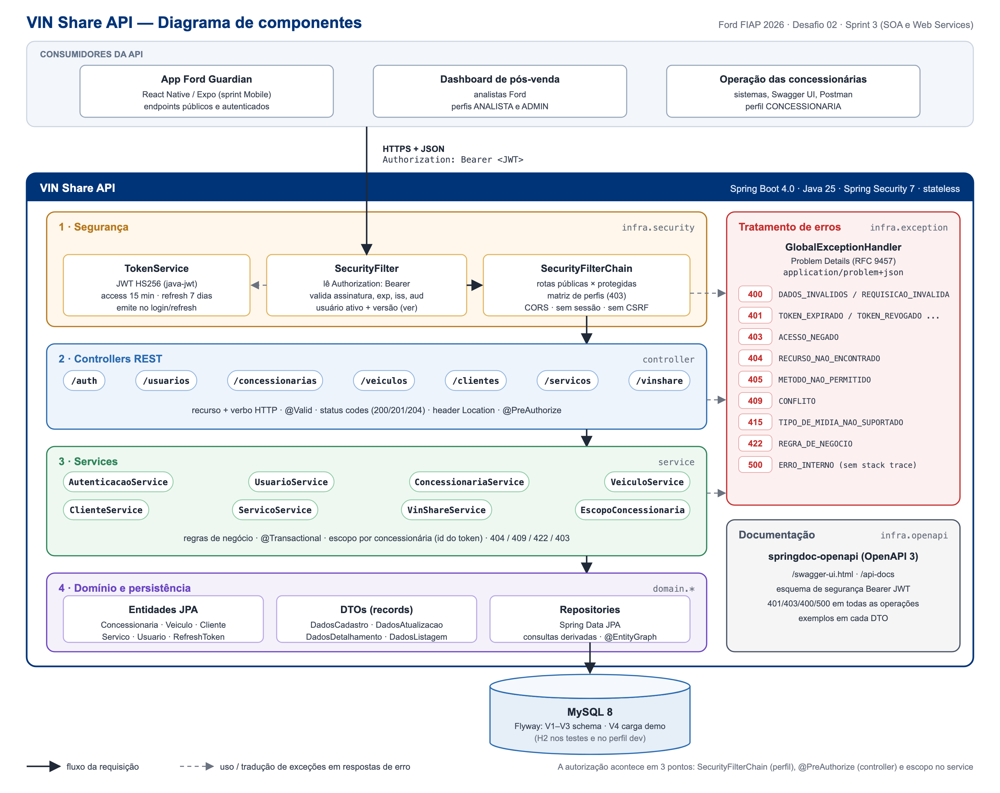
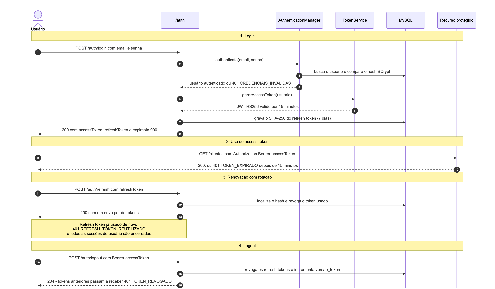

# VIN Share API - Ford FIAP 2026

[](https://github.com/FelipeMarquesdeOliveira/fiap-sprint-ford-soa/actions/workflows/ci.yml)


API RESTful para gestão e análise do **VIN Share** na rede de concessionárias Ford, desenvolvida para o
**Desafio 02 - Impulsionando o VIN Share na América do Sul** (Ford FIAP 2026).

O VIN Share é o percentual de veículos Ford que continuam fazendo manutenção na rede oficial. A API registra
concessionárias, veículos (VIN), clientes e serviços de pós-venda, calcula o VIN Share por concessionária e
identifica os clientes com risco de sair da rede, com autenticação JWT e controle de acesso por perfil.

> **Sprint 3 - Arquitetura Orientada a Serviços e Web Services.** Evolução da API entregue na Sprint 1
> (Spring Boot + MySQL + Flyway), agora com segurança, JWT, maturidade REST nível 2, testes automatizados,
> documentação OpenAPI e erros padronizados.

## Sumário

- [Entregas da Sprint 3](#entregas-da-sprint-3)
- [Arquitetura](#arquitetura)
- [Como executar](#como-executar)
- [Autenticação e autorização](#autenticação-e-autorização)
- [JWT](#jwt)
- [Endpoints](#endpoints)
- [Maturidade REST - nível 2](#maturidade-rest---nível-2)
- [Padrão de erros](#padrão-de-erros)
- [Testes automatizados](#testes-automatizados)
- [Tecnologias](#tecnologias)
- [Equipe](#equipe)

## Entregas da Sprint 3

| Critério (peso) | O que foi feito | Onde ver |
|---|---|---|
| **Arquitetura da solução (20%)** | Diagrama de componentes, camadas com responsabilidades definidas (`controller -> service -> repository`), diagramas de sequência da comunicação e da autenticação, modelo de dados e decisões de arquitetura | [docs/ARQUITETURA.md](docs/ARQUITETURA.md) |
| **Autenticação e autorização (20%)** | Spring Security stateless, endpoints públicos e protegidos, 3 perfis (`ADMIN`, `ANALISTA`, `CONCESSIONARIA`), matriz de permissões por rota e escopo de dados por concessionária | [SecurityConfig](src/main/java/br/com/ford/vinshare/infra/security/SecurityConfig.java), [seção abaixo](#autenticação-e-autorização) |
| **JWT (15%)** | Geração e validação (HS256, `iss`, `aud`, `exp`, `nbf`, `jti`), access token de 15 min, refresh token com rotação e detecção de reuso, revogação no logout e na troca de perfil | [TokenService](src/main/java/br/com/ford/vinshare/infra/security/TokenService.java), [SecurityFilter](src/main/java/br/com/ford/vinshare/infra/security/SecurityFilter.java), [seção JWT](#jwt) |
| **Maturidade REST nível 2 (20%)** | Recursos com URIs próprias (`/clientes/{id}`, `/veiculos/{id}/servicos`), `GET/POST/PUT/PATCH/DELETE` com a semântica correta, `201 + Location`, `204`, `400/401/403/404/405/409/415/422` | [seção abaixo](#maturidade-rest---nível-2) |
| **Testes automatizados (15%)** | 162 testes (JUnit 6 + MockMvc + Mockito) cobrindo sucesso, erro e acesso não autorizado; 92,8% de cobertura de linhas; CI no GitHub Actions | [docs/evidencias](docs/evidencias/), [Actions](https://github.com/FelipeMarquesdeOliveira/fiap-sprint-ford-soa/actions) |
| **Documentação e tratamento de erros (10%)** | OpenAPI 3 / Swagger UI, erros no padrão Problem Details (RFC 9457) com catálogo de códigos, este README | `/swagger-ui.html`, [docs/openapi.json](docs/openapi.json), [docs/ERROS.md](docs/ERROS.md) |

Correções em relação à Sprint 1: o projeto não compilava (entidades sem setters, `findAllByAtivoTrue` em entidades
sem esse campo, springdoc 2.x incompatível com Spring Boot 4) e a migration V1 criava um índice sobre uma coluna
inexistente. Os `PUT` recebiam o id no corpo (`PUT /clientes`) e passaram a seguir a URI do recurso (`PUT /clientes/{id}`).
Também foi incluído o Maven Wrapper, que o README citava mas não existia no repositório.

## Arquitetura



| Camada | Pacote | Responsabilidade |
|---|---|---|
| Segurança | `infra.security` | Autenticação JWT, matriz de perfis, CORS, emissão/validação de tokens |
| Apresentação | `controller` | Recursos REST, verbos, validação de entrada, status codes, documentação |
| Serviço | `service` | Regras de negócio, transações, escopo por concessionária, cálculo do VIN Share |
| Domínio | `domain.*` | Entidades JPA, DTOs (`record`), enums, exceções de domínio, repositories |
| Transversais | `infra.exception`, `infra.openapi` | Problem Details e contrato OpenAPI |

Detalhes, fluxos de comunicação/autenticação e modelo de dados: **[docs/ARQUITETURA.md](docs/ARQUITETURA.md)**.

## Como executar

Pré-requisitos: **JDK 25**. O Maven Wrapper (`./mvnw`) baixa o Maven automaticamente.

### Opção 1 - rápida, sem banco para instalar (H2 em memória)

```bash
./mvnw spring-boot:run -Dspring-boot.run.profiles=dev
```

### Opção 2 - MySQL via Docker + API via Maven

```bash
docker compose up -d mysql
./mvnw spring-boot:run
```

### Opção 3 - tudo em containers (MySQL + API)

```bash
docker compose up -d --build
```

Em qualquer opção, as migrations do Flyway criam o schema e a carga de demonstração, e a API sobe em **http://localhost:8085**:

| Recurso | URL |
|---|---|
| Swagger UI | http://localhost:8085/swagger-ui.html |
| Contrato OpenAPI (JSON) | http://localhost:8085/api-docs |
| Health check | http://localhost:8085/health-check |

### Configuração

| Variável de ambiente | Padrão | Descrição |
|---|---|---|
| `DB_URL` | `jdbc:mysql://localhost:3306/vinshare?createDatabaseIfNotExist=true` | URL do MySQL |
| `DB_USERNAME` / `DB_PASSWORD` | `root` / `fiap` | Credenciais do banco (mesmas da Sprint 1) |
| `JWT_SECRET` | segredo de desenvolvimento | Segredo HS256 (**mínimo 32 bytes**; obrigatório trocar em produção) |
| `JWT_ACCESS_EXPIRATION` | `PT15M` | Validade do access token (ISO-8601) |
| `JWT_REFRESH_EXPIRATION` | `P7D` | Validade do refresh token |
| `CORS_ALLOWED_ORIGINS` | `http://localhost:8081,...` | Origens web autorizadas (ex.: Expo Web) |
| `PORT` | `8085` | Porta HTTP |

### Usuários de demonstração

| E-mail | Senha | Perfil | Concessionária |
|---|---|---|---|
| `admin@vinshare.test` | `Admin@123` | `ADMIN` | - |
| `analista@vinshare.test` | `Analista@123` | `ANALISTA` | - |
| `concessionaria.sp@vinshare.test` | `Conc@1234` | `CONCESSIONARIA` | 1 - Ford Paulista Centro |
| `concessionaria.rj@vinshare.test` | `Conc@1234` | `CONCESSIONARIA` | 2 - Ford Carioca Barra |

A carga (`db/seed`) inclui 4 concessionárias, 10 veículos, 10 clientes e 15 serviços, resultando em VIN Share geral de 70%.

### Exemplo rápido com curl

```bash
# 1. login
TOKEN=$(curl -s -X POST http://localhost:8085/auth/login \
  -H 'Content-Type: application/json' \
  -d '{"email":"analista@vinshare.test","senha":"Analista@123"}' | jq -r .accessToken)

# 2. recurso protegido
curl -s http://localhost:8085/vinshare/dashboard -H "Authorization: Bearer $TOKEN" | jq

# 3. sem token -> 401 application/problem+json
curl -i http://localhost:8085/clientes
```

Uma sequência completa (login, 403 entre concessionárias, refresh, logout) está em [docs/requisicoes.http](docs/requisicoes.http),
executável no VS Code (extensão REST Client) ou no IntelliJ.

## Autenticação e autorização



**Endpoints públicos:** `POST /auth/login`, `POST /auth/refresh`, `GET /health-check`, `GET /concessionarias`,
`GET /concessionarias/{id}` (localizar a rede oficial é informação pública, usada pelo app) e a documentação
(`/swagger-ui.html`, `/api-docs`). **Todo o resto exige `Authorization: Bearer <token>`.**

**Perfis:**

| Perfil | Quem é | Escopo |
|---|---|---|
| `ADMIN` | Equipe Ford | Acesso total, gestão de usuários e da rede de concessionárias |
| `ANALISTA` | Analista de pós-venda Ford | Leitura de toda a rede e dos indicadores de VIN Share (sem escrita) |
| `CONCESSIONARIA` | Gestor de uma concessionária | Veículos; clientes e serviços **da própria concessionária**; o próprio VIN Share |

A autorização acontece em três pontos:

1. **`SecurityFilterChain`** - matriz de perfis por rota. A requisição é barrada antes de chegar ao controller,
   então um perfil sem permissão recebe `403` mesmo enviando um corpo inválido.
2. **`@PreAuthorize`** nos controllers - segunda barreira, junto do endpoint.
3. **Services** - escopo por concessionária: o id da concessionária vem do token, nunca do corpo da requisição.
   Acessar cliente/serviço de outra concessionária retorna `403` (proteção contra IDOR, OWASP API1).

Senhas são armazenadas com **BCrypt**; o login responde a mesma mensagem para usuário inexistente, senha errada
ou conta inativa (evita enumeração de usuários).

## JWT

| Item | Implementação |
|---|---|
| Biblioteca / algoritmo | `com.auth0:java-jwt`, HMAC-SHA256 com segredo de no mínimo 32 bytes (validado na inicialização) |
| Claims registrados | `iss` (`vinshare-api`), `aud` (`vinshare-clients`), `sub` (id do usuário), `jti`, `iat`, `nbf`, `exp` |
| Claims privados | `tipo` (`access`), `email`, `nome`, `perfil`, `concessionariaId` (só perfil `CONCESSIONARIA`), `ver` (versão do token) |
| Expiração | Access token **15 minutos**; refresh token opaco **7 dias** (configuráveis) |
| Validação a cada requisição | algoritmo fixo (rejeita `alg: none`), assinatura, `iss`, `aud`, `tipo`, `exp`/`nbf`, usuário ativo e `ver` atual |
| Renovação | `POST /auth/refresh` com **rotação**: o refresh token usado é revogado e um novo par é emitido |
| Detecção de reuso | reapresentar um refresh token já usado revoga todas as sessões do usuário |
| Revogação | logout, troca de perfil e desativação incrementam `versao_token`: os access tokens anteriores passam a receber `401 TOKEN_REVOGADO` |
| Armazenamento | somente o hash SHA-256 do refresh token é gravado; o access token é stateless |
| Uso das informações do token | `sub` identifica o usuário; `concessionariaId` define o escopo de dados. Permissões vêm do cadastro no servidor (um claim `perfil` forjado não concede acesso) |

Exemplo de resposta do login:

```json
{
  "accessToken": "eyJhbGciOiJIUzI1NiIsInR5cCI6IkpXVCJ9...",
  "tokenType": "Bearer",
  "expiresIn": 900,
  "refreshToken": "l6KBsLqBnr_wobQrIkn9hwhyYcRMabCCRdQmrp2Tjxo",
  "refreshExpiresIn": 604800,
  "usuario": { "id": 3, "nome": "Gestor Ford Paulista", "email": "concessionaria.sp@vinshare.test",
               "perfil": "CONCESSIONARIA", "concessionariaId": 1 }
}
```

## Endpoints

Legenda de acesso: **Público**, **Todos** (qualquer perfil autenticado), **A** = ADMIN, **N** = ANALISTA,
**C** = CONCESSIONARIA (*própria* = restrito à própria concessionária).

### Autenticação

| Método | Rota | Descrição | Acesso | Sucesso | Erros |
|---|---|---|---|---|---|
| POST | `/auth/login` | Login, retorna access + refresh token | Público | 200 | 400, 401, 415 |
| POST | `/auth/refresh` | Renova o par de tokens (rotação) | Público | 200 | 400, 401 |
| POST | `/auth/logout` | Revoga as sessões do usuário | Todos | 204 | 401 |

### Usuários

| Método | Rota | Descrição | Acesso | Sucesso | Erros |
|---|---|---|---|---|---|
| GET | `/usuarios/me` | Dados do usuário do token | Todos | 200 | 401 |
| GET | `/usuarios` | Lista paginada | A | 200 | 401, 403 |
| GET | `/usuarios/{id}` | Detalhe | A | 200 | 401, 403, 404 |
| POST | `/usuarios` | Cria usuário | A | 201 | 400, 401, 403, 409, 422 |
| PATCH | `/usuarios/{id}` | Altera nome, perfil, concessionária ou status | A | 200 | 400, 401, 403, 404, 422 |
| DELETE | `/usuarios/{id}` | Desativa (exclusão lógica) | A | 204 | 401, 403, 404, 422 |

### Concessionárias

| Método | Rota | Descrição | Acesso | Sucesso | Erros |
|---|---|---|---|---|---|
| GET | `/concessionarias?estado=SP` | Lista paginada, filtro por UF | Público | 200 | 400 |
| GET | `/concessionarias/{id}` | Detalhe | Público | 200 | 404 |
| POST | `/concessionarias` | Cria | A | 201 | 400, 401, 403, 409 |
| PUT | `/concessionarias/{id}` | Substitui a representação completa | A | 200 | 400, 401, 403, 404, 409 |
| PATCH | `/concessionarias/{id}` | Atualização parcial | A | 200 | 400, 401, 403, 404 |
| DELETE | `/concessionarias/{id}` | Exclusão lógica | A | 204 | 401, 403, 404 |

### Veículos

| Método | Rota | Descrição | Acesso | Sucesso | Erros |
|---|---|---|---|---|---|
| GET | `/veiculos?modelo=ranger` | Lista paginada, filtro por modelo | Todos | 200 | 401 |
| GET | `/veiculos/{id}` | Detalhe | Todos | 200 | 401, 404 |
| GET | `/veiculos/{id}/servicos` | Histórico de serviços do VIN (sub-recurso) | Todos | 200 | 401, 404 |
| POST | `/veiculos` | Cria | A, C | 201 | 400, 401, 403, 409 |
| PUT | `/veiculos/{id}` | Substitui | A, C | 200 | 400, 401, 403, 404, 409 |
| PATCH | `/veiculos/{id}` | Atualização parcial (VIN imutável) | A, C | 200 | 400, 401, 403, 404 |
| DELETE | `/veiculos/{id}` | Remove (se não houver vínculos) | A | 204 | 401, 403, 404, 409 |

### Clientes

| Método | Rota | Descrição | Acesso | Sucesso | Erros |
|---|---|---|---|---|---|
| GET | `/clientes` | Lista paginada | A, N, C *própria* | 200 | 401 |
| GET | `/clientes/{id}` | Detalhe | A, N, C *própria* | 200 | 401, 403, 404 |
| POST | `/clientes` | Cria | A, C *própria* | 201 | 400, 401, 403, 409, 422 |
| PUT | `/clientes/{id}` | Substitui | A, C *própria* | 200 | 400, 401, 403, 404, 409, 422 |
| PATCH | `/clientes/{id}` | Atualização parcial | A, C *própria* | 200 | 400, 401, 403, 404 |
| DELETE | `/clientes/{id}` | Exclusão lógica | A, C *própria* | 204 | 401, 403, 404 |

### Serviços

| Método | Rota | Descrição | Acesso | Sucesso | Erros |
|---|---|---|---|---|---|
| GET | `/servicos?status=AGENDADO` | Lista paginada, filtro por status | A, N, C *própria* | 200 | 400, 401 |
| GET | `/servicos/{id}` | Detalhe | A, N, C *própria* | 200 | 401, 403, 404 |
| POST | `/servicos` | Registra serviço | A, C *própria* | 201 | 400, 401, 403, 422 |
| PUT | `/servicos/{id}` | Substitui (se não finalizado) | A, C *própria* | 200 | 400, 401, 403, 404, 422 |
| PATCH | `/servicos/{id}` | Atualização parcial, ex.: concluir | A, C *própria* | 200 | 400, 401, 403, 404, 422 |
| DELETE | `/servicos/{id}` | Remove | A | 204 | 401, 403, 404 |

### VIN Share e Health Check

| Método | Rota | Descrição | Acesso | Sucesso | Erros |
|---|---|---|---|---|---|
| GET | `/vinshare/dashboard` | Indicadores consolidados da rede | A, N | 200 | 401, 403 |
| GET | `/vinshare/concessionarias` | VIN Share de cada concessionária | A, N | 200 | 401, 403 |
| GET | `/vinshare/concessionarias/{id}` | VIN Share de uma concessionária | A, N, C *própria* | 200 | 401, 403, 404 |
| GET | `/vinshare/clientes-risco` | Clientes com 0 ou 1 serviço concluído (CPF mascarado) | A, N, C *própria* | 200 | 401, 403 |
| GET | `/health-check` | Disponibilidade | Público | 200 | - |

Listagens são paginadas (`?page=0&size=10&sort=nome,asc`) e retornam `{ "content": [...], "page": { "size", "number", "totalElements", "totalPages" } }`.

## Maturidade REST - nível 2

| Nível de Richardson | Como a API atende |
|---|---|
| **1 - Recursos** | Cada entidade tem sua URI (`/clientes`, `/clientes/{id}`), inclusive sub-recursos (`/veiculos/{id}/servicos`). Filtros usam query string (`?estado=SP`, `?status=AGENDADO`) |
| **2 - Verbos HTTP** | `GET` (leitura segura e idempotente), `POST` (criação), `PUT` (substituição completa e idempotente: exige todos os campos obrigatórios), `PATCH` (atualização parcial: só os campos enviados), `DELETE` (remoção) |
| **2 - Status codes** | Ver tabela abaixo |

| Status | Uso |
|---|---|
| `200 OK` | Leitura, `PUT`, `PATCH`, login e refresh |
| `201 Created` | `POST` que cria recurso, com header `Location` apontando para a URI do novo recurso |
| `204 No Content` | `DELETE` e logout |
| `400 Bad Request` | Validação dos campos, JSON malformado, tipo/enum inválido |
| `401 Unauthorized` | Sem token, token inválido/expirado/revogado ou credenciais inválidas (com `WWW-Authenticate`) |
| `403 Forbidden` | Autenticado sem permissão (perfil ou concessionária) |
| `404 Not Found` | Recurso inexistente/excluído ou rota inexistente |
| `405 Method Not Allowed` | Verbo não suportado pelo recurso (com header `Allow`) |
| `409 Conflict` | Duplicidade (CNPJ, VIN, CPF, e-mail) ou recurso em uso |
| `415 Unsupported Media Type` | Corpo que não é `application/json` |
| `422 Unprocessable Content` | Requisição válida que viola regra de negócio |
| `500 Internal Server Error` | Falha inesperada, sem expor detalhes internos |

## Padrão de erros

Todas as respostas de erro, inclusive as geradas pelo Spring Security antes do controller, usam
**Problem Details (RFC 9457)** com `Content-Type: application/problem+json`:

```json
{
  "type": "https://github.com/FelipeMarquesdeOliveira/fiap-sprint-ford-soa/blob/main/docs/ERROS.md#acesso_negado",
  "title": "Acesso negado",
  "status": 403,
  "detail": "Este cliente pertence a outra concessionária.",
  "instance": "/clientes/4",
  "codigo": "ACESSO_NEGADO",
  "timestamp": "2026-09-25T04:39:13.245756Z"
}
```

Erros de validação trazem também `"erros": [{ "campo": "cnpj", "mensagem": "CNPJ inválido" }]`.
Catálogo completo dos códigos: **[docs/ERROS.md](docs/ERROS.md)**.

## Testes automatizados

```bash
./mvnw verify                                  # compila, roda os 162 testes e gera a cobertura
open target/site/jacoco/index.html             # relatório de cobertura (JaCoCo)
python3 scripts/relatorio_testes.py            # regenera docs/evidencias/RELATORIO-TESTES.md
```

Os testes de integração sobem a aplicação completa (filtros de segurança, controllers, services, JPA e Flyway)
sobre H2 em memória com a mesma carga de demonstração; cada teste roda em uma transação desfeita ao final.

| Classe | O que verifica |
|---|---|
| `TokenServiceTest` | Claims gerados, expiração, assinatura inválida, payload adulterado, `alg: none`, emissor/audiência/tipo incorretos, segredo fraco |
| `AutenticacaoControllerTest` | Login (200/400/401/415), usuário inativo, refresh com rotação, reuso de refresh token, refresh expirado, logout revogando tokens |
| `SegurancaJwtTest` | Endpoints públicos × protegidos, `WWW-Authenticate`, token expirado/falsificado/`none`/audiência errada, header malformado, usuário desativado, claim de perfil forjado |
| `AutorizacaoPorPerfilTest` | Matriz de permissões: 36 combinações de perfil × método × rota |
| `ConcessionariaControllerTest`, `VeiculoControllerTest`, `ClienteControllerTest`, `ServicoControllerTest`, `UsuarioControllerTest` | CRUD com `201 + Location`, `204`, `404`, `409`, `422`, `PUT` × `PATCH`, escopo por concessionária |
| `VinShareControllerTest`, `VinShareServiceTest` | Cálculo do VIN Share, clientes em risco, escopo, fluxo completo (registrar serviço eleva o indicador) |
| `TratamentoDeErrosTest` | Formato Problem Details em 400/404/405, parâmetros e enums inválidos |
| `OpenApiDocumentacaoTest` | Contrato OpenAPI publicado, esquema Bearer, respostas de erro documentadas |
| `RegrasDeDominioTest` | Regras das entidades (escopo, revogação por versão, status finais) |

**Evidências** ([docs/evidencias](docs/evidencias/)):

| Evidência | Arquivo |
|---|---|
| Relatório com todos os testes e a classificação sucesso / erro / não autorizado | [RELATORIO-TESTES.md](docs/evidencias/RELATORIO-TESTES.md) |
| Saída da execução do `./mvnw verify` | [execucao-testes.txt](docs/evidencias/execucao-testes.txt), [execucao-testes.png](docs/evidencias/execucao-testes.png) |
| Cobertura (JaCoCo) | [cobertura-jacoco.png](docs/evidencias/cobertura-jacoco.png) |
| Swagger UI | [swagger-ui.png](docs/evidencias/swagger-ui.png) |
| Execução no CI | [GitHub Actions](https://github.com/FelipeMarquesdeOliveira/fiap-sprint-ford-soa/actions/workflows/ci.yml) (artefato `relatorios-de-teste`) |

## Tecnologias

| Tecnologia | Uso |
|---|---|
| Java 25 + Spring Boot 4.0.5 | Plataforma (Spring Framework 7) |
| Spring Web MVC | API REST |
| Spring Security 7 | Autenticação stateless, autorização por perfil e por método |
| java-jwt (Auth0) 4.6 | Geração e validação de JWT |
| Spring Data JPA / Hibernate 7 | Persistência |
| MySQL 8 + Flyway | Banco de dados e controle de migrações |
| H2 | Perfil `dev` e testes |
| Bean Validation + Hibernate Validator | Validação (inclui `@CPF` e `@CNPJ`) |
| springdoc-openapi 3 | OpenAPI 3 e Swagger UI |
| JUnit 6, MockMvc, Mockito, AssertJ, JaCoCo | Testes e cobertura |
| Docker Compose / GitHub Actions | Execução em containers e integração contínua |

## Estrutura do projeto

```
fiap-sprint-ford-soa/
├── src/main/java/br/com/ford/vinshare/
│   ├── controller/        # recursos REST
│   ├── service/           # regras de negócio
│   ├── domain/            # entidades, DTOs, repositories, exceções
│   └── infra/             # segurança, tratamento de erros, OpenAPI
├── src/main/resources/
│   ├── application.properties         # MySQL (padrão)
│   ├── application-dev.properties     # H2 em memória
│   ├── db/migration/                  # V1-V3: schema
│   └── db/seed/                       # V4: carga de demonstração
├── src/test/java/...                  # 162 testes
├── docs/                              # arquitetura, erros, OpenAPI, evidências
├── scripts/relatorio_testes.py        # gera o relatório de evidências
├── .github/workflows/ci.yml           # pipeline de CI
├── Dockerfile / docker-compose.yml
└── mvnw / pom.xml
```

## Equipe

Projeto desenvolvido para o **Ford FIAP 2026 - Desafio 02: Impulsionando o VIN Share na América do Sul com Soluções Inteligentes**.

| Nome | RM |
|---|---|
| Felipe Marques de Oliveira | 556319 |
| Gabriel Barros Cisoto | 556309 |

## Licença

Uso acadêmico - FIAP.
