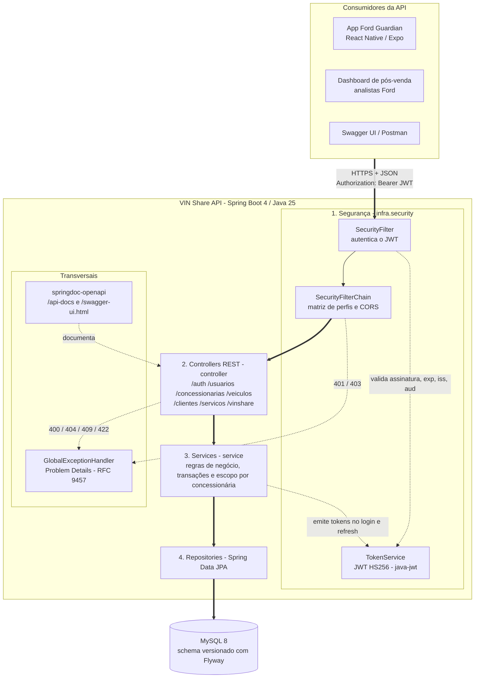
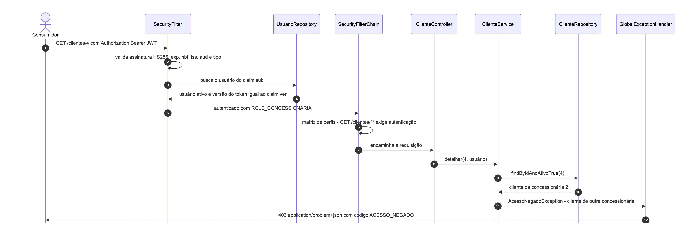
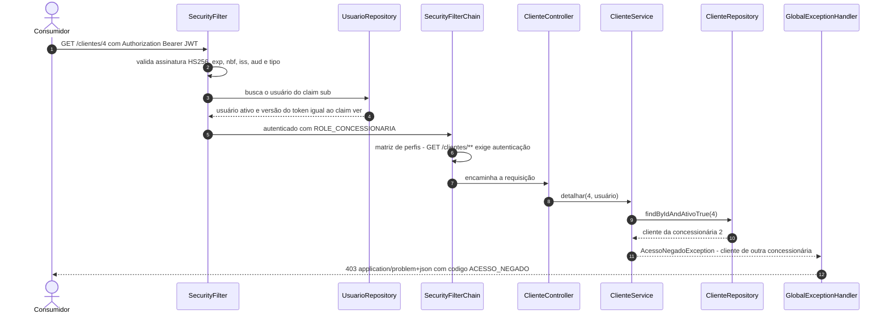
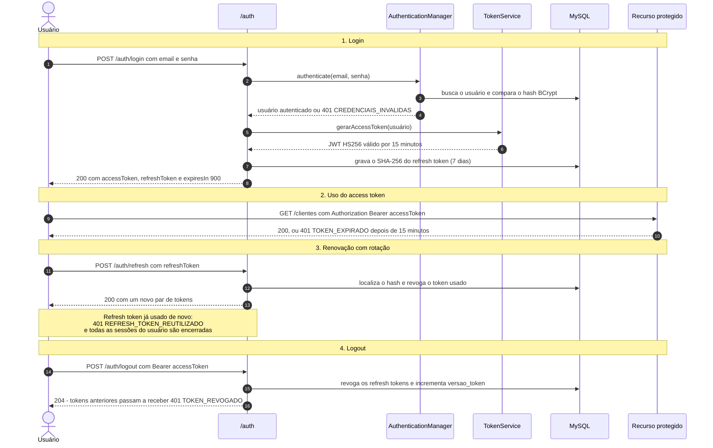
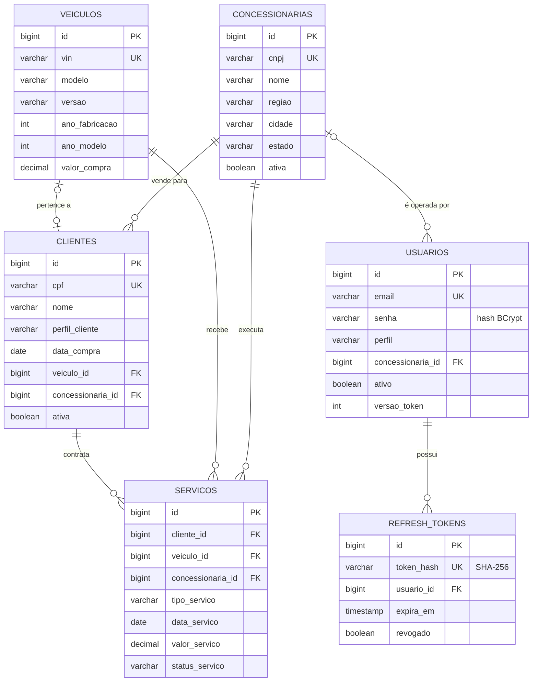

# Arquitetura da solução - VIN Share API

Documento de arquitetura da Sprint 3 (Arquitetura Orientada a Serviços e Web Services).
Os diagramas abaixo usam Mermaid (renderizados pelo GitHub). As versões em imagem ficam em [`docs/arquitetura/`](arquitetura/).

## Sumário

1. [Contexto](#1-contexto)
2. [Diagrama de componentes](#2-diagrama-de-componentes)
3. [Organização e responsabilidades](#3-organização-e-responsabilidades)
4. [Fluxo de comunicação de uma requisição](#4-fluxo-de-comunicação-de-uma-requisição)
5. [Fluxo de autenticação](#5-fluxo-de-autenticação)
6. [JWT: estrutura, validação, expiração e revogação](#6-jwt-estrutura-validação-expiração-e-revogação)
7. [Autorização: perfis e escopo](#7-autorização-perfis-e-escopo)
8. [Modelo de dados](#8-modelo-de-dados)
9. [Decisões de arquitetura](#9-decisões-de-arquitetura)

---

## 1. Contexto

**Desafio 02 - Impulsionando o VIN Share na América do Sul.** O VIN Share é o percentual de veículos Ford que
continuam fazendo manutenção na rede oficial. A VIN Share API é o serviço central da solução: registra a rede de
concessionárias, os veículos (VIN), os clientes e os serviços de pós-venda, e calcula os indicadores de retenção
(VIN Share por concessionária e clientes com risco de evasão).

Consumidores previstos:

| Consumidor | Uso | Perfil |
|---|---|---|
| App mobile **Ford Guardian** (React Native/Expo, sprint de Mobile) | localizar concessionárias (endpoints públicos) e consultar dados do veículo | público / autenticado |
| Dashboard de pós-venda da Ford | indicadores de VIN Share da rede e clientes em risco | `ANALISTA`, `ADMIN` |
| Sistemas/operadores das concessionárias | registrar clientes e serviços, acompanhar o próprio VIN Share | `CONCESSIONARIA` |

## 2. Diagrama de componentes


<details>
<summary>Versão em Mermaid (editável)</summary>



</details>

## 3. Organização e responsabilidades

A aplicação segue uma arquitetura em camadas, com dependência sempre no sentido
`controller -> service -> repository`. Nenhuma camada conhece a camada acima dela.

| Camada | Pacote | Responsabilidade | O que **não** faz |
|---|---|---|---|
| Segurança | `infra.security` | Autenticar o JWT (`SecurityFilter`), aplicar a matriz de perfis (`SecurityConfig`), emitir/validar tokens (`TokenService`), CORS | Regras de negócio |
| Apresentação (REST) | `controller` | Mapear recursos e verbos HTTP, validar a entrada (`@Valid`), definir status codes e headers (`Location`), documentar a API | Acessar o banco ou decidir regras |
| Serviço | `service` | Regras de negócio, escopo por concessionária, transações (`@Transactional`), cálculo do VIN Share | Conhecer HTTP (não usa `ResponseEntity`) |
| Domínio | `domain.*` | Entidades JPA com comportamento (`excluir()`, `atualizarInformacoes()`), DTOs imutáveis (`record`), enums e exceções de domínio | Depender de frameworks web |
| Persistência | `domain.*.*Repository` + `db/migration` | Acesso a dados com Spring Data JPA; versionamento do schema com Flyway | Regras de negócio |
| Tratamento de erros | `infra.exception` | Traduzir exceções para respostas Problem Details padronizadas | - |
| Documentação | `infra.openapi` | Contrato OpenAPI 3, esquema de segurança Bearer e respostas de erro padrão | - |

```
src/main/java/br/com/ford/vinshare
├── controller/          # REST: recursos, verbos, status codes
├── service/             # regras de negócio e escopo por concessionária
├── domain/
│   ├── autenticacao/    # refresh token, DTOs de login
│   ├── usuario/         # Usuario (UserDetails), Perfil
│   ├── concessionaria/  # entidade, repository, DTOs
│   ├── veiculo/
│   ├── cliente/
│   ├── servico/
│   ├── vinshare/        # DTOs dos indicadores
│   └── exception/       # exceções de domínio (404, 409, 422, 403)
└── infra/
    ├── security/        # SecurityConfig, SecurityFilter, TokenService
    ├── exception/       # GlobalExceptionHandler, catálogo de erros
    └── openapi/         # configuração do Swagger
```

## 4. Fluxo de comunicação de uma requisição

Exemplo: um usuário da concessionária de São Paulo tenta ler um cliente da concessionária do Rio de Janeiro.





Pontos de decisão ao longo do fluxo:

| Onde | Verificação | Resposta em caso de falha |
|---|---|---|
| `SecurityFilter` | JWT válido, usuário ativo, versão do token atual | `401` `TOKEN_INVALIDO`, `TOKEN_EXPIRADO` ou `TOKEN_REVOGADO` |
| `SecurityFilterChain` | rota pública ou autenticada; perfil exigido pela rota | `401` `NAO_AUTENTICADO` / `403` `ACESSO_NEGADO` |
| Controller (`@Valid`) | formato e obrigatoriedade dos campos | `400` `DADOS_INVALIDOS` |
| Service | existência, duplicidade, escopo por concessionária, regras de negócio | `404`, `409`, `403`, `422` |

## 5. Fluxo de autenticação




## 6. JWT: estrutura, validação, expiração e revogação

### Estrutura do access token

```json
// header
{ "alg": "HS256", "typ": "JWT" }
// payload
{
  "iss": "vinshare-api",
  "aud": "vinshare-clients",
  "sub": "3",
  "jti": "2f0b7c3e-5d0a-4c1e-9b8e-0c6f1d7a9e21",
  "iat": 1790311152,
  "nbf": 1790311152,
  "exp": 1790312052,
  "tipo": "access",
  "email": "concessionaria.sp@vinshare.test",
  "nome": "Gestor Ford Paulista",
  "perfil": "CONCESSIONARIA",
  "concessionariaId": 1,
  "ver": 0
}
```

| Claim | Uso na API |
|---|---|
| `sub` | Identifica o usuário; o `SecurityFilter` carrega o cadastro a partir dele |
| `iss` / `aud` | Garantem que o token foi emitido por esta API e para os clientes dela |
| `exp` / `nbf` / `iat` | Janela de validade (15 minutos, configurável em `api.security.jwt.access-token-expiration`) |
| `jti` | Identificador único de cada token (rastreabilidade) |
| `tipo` | Só tokens do tipo `access` são aceitos como credencial |
| `perfil`, `nome`, `email` | Informativos para o cliente (ex.: montar menus no app) |
| `concessionariaId` | Escopo do usuário `CONCESSIONARIA`: os services usam esse valor, e nunca o corpo da requisição, para definir a concessionária de clientes e serviços |
| `ver` | Versão do token: se for diferente da versão atual do usuário, o token foi revogado |

### Validações feitas a cada requisição

1. Header no formato `Authorization: Bearer <token>`.
2. Algoritmo fixo HS256 (tokens com `alg: none` ou outro algoritmo são rejeitados).
3. Assinatura com o segredo `JWT_SECRET` (mínimo de 32 bytes, verificado na inicialização).
4. `iss`, `aud` e `tipo` esperados; presença de `perfil` e `ver`.
5. `exp` e `nbf` (tolerância de 1 segundo).
6. Usuário do `sub` existe, está ativo e tem a mesma versão de token (`ver`).

As permissões são sempre derivadas do cadastro do usuário no servidor: um claim `perfil` adulterado não concede acesso
(coberto pelo teste `SegurancaJwtTest.perfilNaoPodeSerForjado`).

### Expiração e renovação

| Token | Formato | Validade | Armazenamento no servidor |
|---|---|---|---|
| Access token | JWT assinado (HS256) | 15 minutos | nenhum (stateless) |
| Refresh token | valor aleatório de 256 bits (Base64URL) | 7 dias | somente o hash SHA-256 (tabela `refresh_tokens`) |

- **Rotação:** cada `POST /auth/refresh` revoga o refresh token usado e entrega um novo par.
- **Detecção de reuso:** apresentar um refresh token já rotacionado indica vazamento; todas as sessões do usuário são revogadas (`REFRESH_TOKEN_REUTILIZADO`).
- **Revogação imediata:** logout, troca de perfil e desativação incrementam `versao_token`, invalidando access tokens ainda dentro da validade.

## 7. Autorização: perfis e escopo

| Perfil | Quem é | Pode |
|---|---|---|
| `ADMIN` | Equipe Ford | Tudo, inclusive gestão de usuários e da rede de concessionárias |
| `ANALISTA` | Analista de pós-venda Ford | Ler toda a rede e os indicadores de VIN Share; não altera dados |
| `CONCESSIONARIA` | Gestor de uma concessionária | Cadastrar veículos; gerir clientes e serviços **da própria concessionária**; ver o próprio VIN Share |

A autorização é aplicada em três camadas (defesa em profundidade):

1. **`SecurityFilterChain`** (antes do controller): rotas públicas e perfil exigido por rota. A requisição é barrada sem nem ler o corpo.
2. **`@PreAuthorize`** nos controllers: repete a regra junto do endpoint (documentação viva e segunda barreira).
3. **Services**: escopo por concessionária. Dados de outra concessionária retornam `403`.

Matriz completa de permissões: [README - Endpoints](../README.md#endpoints).

## 8. Modelo de dados



Migrações Flyway:

| Versão | Local | Conteúdo |
|---|---|---|
| V1 | `db/migration` | tabelas da Sprint 1 (concessionárias, veículos, clientes, serviços). Corrigido o índice que referenciava a coluna inexistente `ativo` |
| V2 | `db/migration` | `usuarios` (perfil, vínculo com concessionária, versão do token) |
| V3 | `db/migration` | `refresh_tokens` |
| V4 | `db/seed` | carga de demonstração (4 concessionárias, 10 veículos, 10 clientes, 15 serviços, 4 usuários) |

## 9. Decisões de arquitetura

| Decisão | Motivo |
|---|---|
| API stateless com JWT (sem sessão HTTP) | Escala horizontalmente e atende app mobile, web e integrações com o mesmo mecanismo |
| Access token curto (15 min) + refresh token opaco com rotação | Limita o impacto de um token vazado sem obrigar o usuário a logar a todo momento |
| Versão do token no cadastro do usuário (`ver`) | Permite revogar tokens JWT (logout, desativação, troca de perfil) mantendo o access token stateless |
| Matriz de perfis na `SecurityFilterChain` | Barra acessos antes do processamento do corpo: um perfil sem permissão sempre recebe `403`, nunca um `400` de validação |
| Escopo por concessionária no service, a partir do token | Evita que um usuário acesse ou crie dados de outra concessionária alterando o corpo da requisição (IDOR / OWASP API1) |
| Problem Details (RFC 9457) + catálogo de códigos | Um único formato de erro para toda a API, com `codigo` estável para o cliente tratar |
| `400` para validação, `422` para regra de negócio | Separa requisição malformada de requisição válida que viola uma regra do domínio |
| Exclusão lógica de concessionárias, clientes e usuários | Preserva o histórico de serviços usado no cálculo do VIN Share |
| H2 em memória para testes e perfil `dev` | Testes rápidos e isolados; o professor pode rodar a API sem instalar MySQL |
